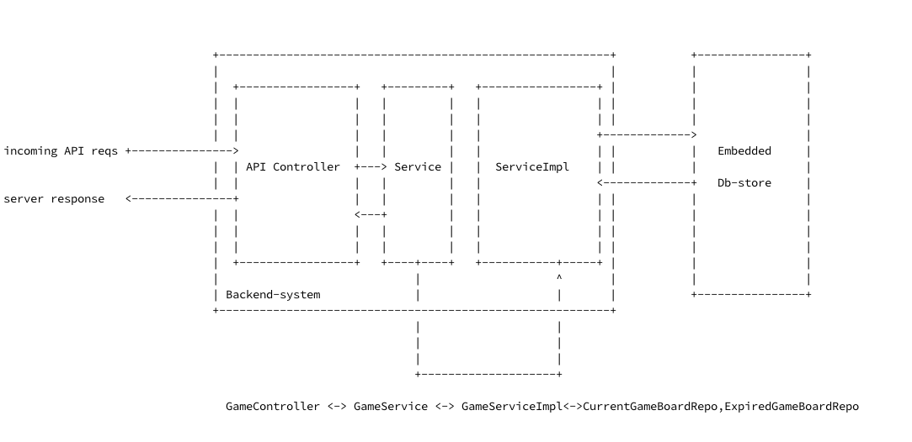

# rest.README #
The default context path is ```/``` . An overview of the rest api is as follows:

api path  | method | description
------------- | -------------| -------------
/setup  | POST | Used for initial setup of the game *Must be the first call!*
/start?[multi_player=```multi_player:boolean``` |GET| Used for starting up the the game. *As an added advantage, the player will get the chance to make the first move.*
/join?session=```sessionId:String```| GET | Used for joining a game initiated by another player. *The player must use ```multi_player=true``` for allowing other players to join.*
/place_chip/```column:Int```/playerRef=```player_ref:String```&boardSessionId=```sessionId;String```| GET| Used for placing a chip on the board.
/stats | GET| Dumps the current stats of the game including current and expired game.


## Rest-params
* setup: A sample *POST* setup data
```
{
  "board_width":7, // mandatory param
  "board_height":6, // mandarory param
  "board_min_con":4, // mandarory param, minimum connection for the game to end
  "ai_dumbness": 1 // Optional param, [0,1] where 0 = a strong ai player, 1 = dumb ai player
}

```
* multi_player: a hint for the server to create a multiplayer game. If ```true``` the server waits for other player to join before allowing a piece placement.

A sample response from server
```
{
    "meta_data": {
        "status": "SUCCESS",
        "http_status": 200
    },
    "game_response": {
        "help_text": "Welcome to Connect4 game, we just created a brand new game session for you! You have the first turn.  Use the player reference to continue.", // a helpful text from server
        "player_ref": "lNvU8dQq6DE9aOd", // this is a unique reference to this player
        "your_chip": "0x1ea863ff", // this is the chip color
        "board_session": "hm1HmOHbwzV4vUE" // this is the game *sessionId*, used in further calls
    }
}
```

* column: A valid column number where the player wants to place the piece in. A sample response from ```/place_chip```
```
{
  "game_response": {
    "board_grid": 
    "row: 6|\t[..........] [..........] [..........] [..........] [..........] [..........] [..........] \n
    row: 5|\t[..........] [..........] [..........] [..........] [..........] [..........] [..........] \n
    row: 4|\t[..........] [..........] [..........] [..........] [..........] [..........] [..........] \n
    row: 3|\t[..........] [..........] [..........] [..........] [..........] [..........] [..........] \n
    row: 2|\t[..........] [..........] [..........] [..........] [..........] [..........] [..........] \n
    row: 1|\t[0x60e7d3ff] [0x1ea863ff] [..........] [..........] [..........] [..........] [..........] \n",
    "game_status": "GAME_IN_PROGRESS",
    "opponent_last_move": "column: 2, position: 1",
    "your_chip": "0x60e7d3ff",
    "your_current_move": "column: 1, position: 1"
  },
  "meta_data": {
    "http_status": 200,
    "status": "SUCCESS"
  }
}
```


# Architecture Overview



